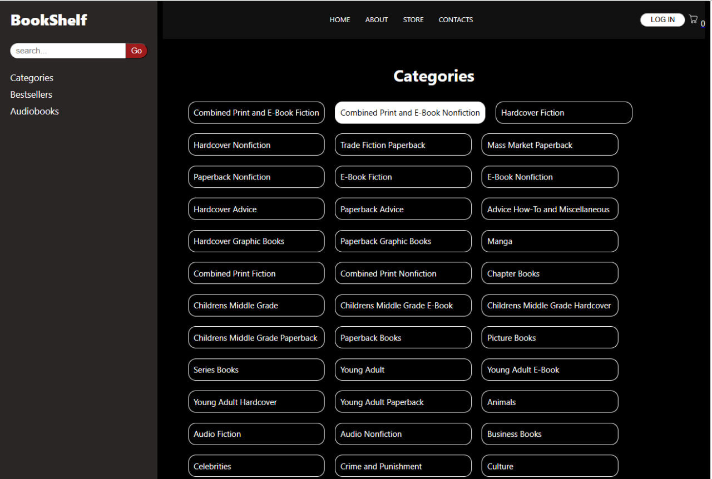

<h1>BookStore</h1>

<h3>Короткий опис</h3>

Це сайт книжкового магазину, який дозволяє переглянути книги в різних категоріях, додати в корзину та відмітити улюблені книги. Реалізовано за допомогою React

<h3>Демо</h3>

<h3>Скріншоти</h3>

<h3>Функціонал</h3>
<ul>
  <li>Головна сторінка
    
Популярні книги в кожній з категорій

  </li>
  <li>Категорії
    
Список категорій

    
Картки з коротким описом книги

  </li>
  <li>Сторінка книги
    
Опис книги, назва, автор, обкладинкая

    
Кнопка додти в кошик та додати до улюблених

  </li>
  <li>Кошик
    
Додавання/видалення книг

    
Загальна сума замовлення

  </li>
  <li>Особистий кабінет
    
Перегляд куплених книг

    
Список бажаних книг

  </li>
</ul>

<h3>Як запустити локально</h3>
<ol>
  <li>Склонуйте репозиторій:
    
 <code> git clone https://github.com/LolyaShi/BookStore.git  </code>

     
<code> cd bookshelf </code>

  </li>
  <li>Встановіть залежності:
    
 <code> npm install sass </code> 

     
<code> npm install react-router-dom </code>

    
 <code>npm install axios</code>

  </li>
  <li>Запустіть локальний сервер
    
<code> npm start </code>

    
  </li>
  <li>Для запуску серверу для авторизадії відкрийте та запустть server в окремому вікні
    
<code> cd server </code>

    
<code> node server.js </code>

  </li>
</ol>

<h3>Використані технології</h3>
<ul>
  <li>React - функціональний підхід</li>
  <li>SASS - препроцесор для стилів</li>
  <li>Node.js - сервер для авторизації користувача</li>
  <li>Використані API:
    
https://nytimes.com

    
https://bigbookapi.com

  </li>
</ul>
